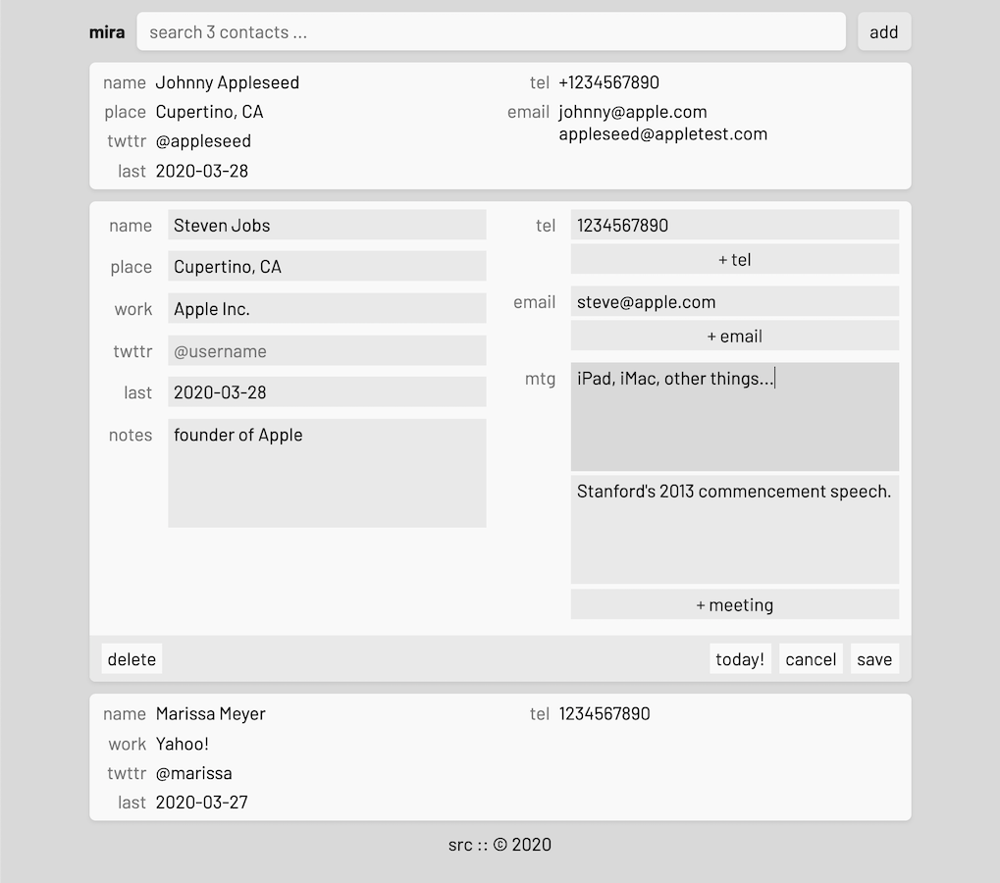

# Mira ☎️

Mira is a personal contacts manager for myself, built for my workflow. A place for notes, but for the people I keep in touch with. It's built with [Torus](https://github.com/thesephist/torus) on the frontend as a single-page app and a lightweight Go backend.

Mira is designed for quick actions and references to people I've met, and things I want to remember about those people. It looks like this in action:



In particular, in addition to normal contact info you see in every app, Mira is capable of storing a few specific kinds of data I like to remember about people:

- past meetings ("mtg"): where are all the places I've met this person, in which occasion, and what did we talk about that I want to remember?
- last met ("last"): when did we last talk? This is useful when I want to follow up with people I haven't talked to in too long.
- place: what city do they live in? This is useful for remembering to visit people I haven't seen in a while whenever I visit a city for the first time in some time.
- unstructured notes: things like extracurricular or volunteering involvements, event attendance, hobbies, and other extraneous information that's useful to know, but not trivial.

## ⚠️ Mira is a prototype ⚠️

This current version of Mira is a "rough draft" of sorts. Eventually, I hope to write a version of Mira that's fast, efficient, and works exactly the way I want my workflow to be. But a problem here is that I'm not even 100% sure what that workflow _looks like_ yet -- I've never had anything that worked super well for me, so my current workflow is pretty ad-hoc and haphazard.

The main point of this first version of Mira is to have a tool that works well, and is a close approximation of an ideal interface, but where I can iterate on the data models and structures / interface quickly to _find_ that ideal workflow, for a second revision, which will probably be written in [Ink](https://github.com/thesephist/ink) as a part of the [Polyx](https://github.com/thesephist/polyx) software suite.

## Architecture

Mira is a mostly-static application on the backend with a single dynamic API endpoint, `/data`, which just stores and makes available a JSON blob for the frontend. This data is managed entirely by the frontend, for quick iteration speed whenever I want to change the data schema. Mira's current version explicitly doesn't use SQLite3 or another relational DB for this reason.

The frontend application is a pretty vanilla Torus application. The core of the Contact data model is stored in the `Contact` record class:

```js
class Contact extends Record {

    singleProperties() {
        return [
            // [ui label, property name, placeholder, use <textarea>?]
            ['name', 'name', 'name'],
            ['place', 'place', 'place'],
            ['work', 'work', 'work'],
            ['twttr', 'twttr', '@username'],
            ['last', 'last', 'last met...'],
            ['notes', 'notes', 'notes', true],
        ];
    }

    multiProperties() {
        return [
            ['tel', 'tel', 'tel'],
            ['email', 'email', 'email'],
            ['mtg', 'mtg', 'meeting', true],
        ]
    }

}
```

Given this schema specified on the model, the rest of the application is designed to compose naturally to result in an editing and viewing interface that suits the schema for each contact item. Adjusting this schema automatically adapts the application to store new kinds of data about each contact, which allows me to tweak and experiment with the exact data format quickly.

In other words, given this schema, the interface shown in the screenshot in this README above is automatically generated by the UI. As we add new fields to the schema, the UI will automatically adapt to include them. This is the core of this, Mira v0.